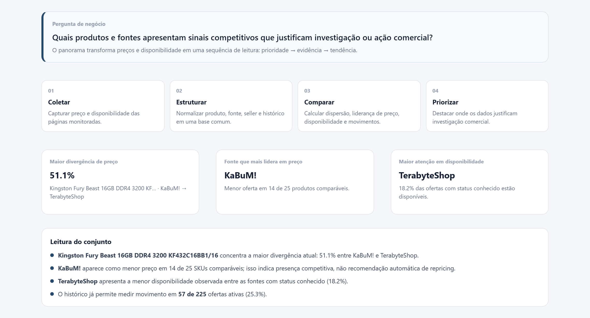
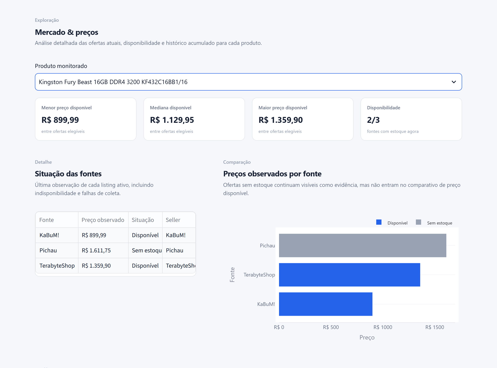
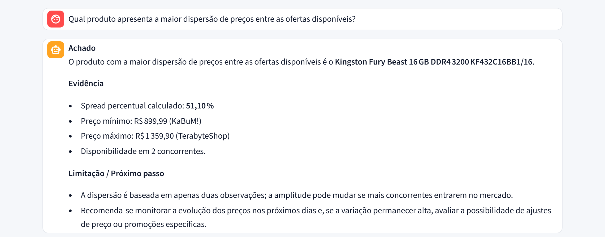

# Competitive Intelligence Agent

Transformando preços e disponibilidade publicados por concorrentes em sinais estruturados de mercado para apoiar análise comercial.

[**Acessar Dashboard Interativo**](https://competitive-intelligence-agent.streamlit.app/)

---

## Problema

Monitorar concorrentes manualmente funciona em baixa escala. O problema aparece quando a operação precisa se repetir, todos os dias, para dezenas de produtos em várias lojas:

1. abrir cada loja e localizar o mesmo SKU;
2. registrar preço e disponibilidade;
3. identificar o que mudou desde a última checagem;
4. separar um movimento real de mercado de um problema de coleta;
5. transformar tudo isso em informação útil para decisão.

Sem histórico estruturado, cada análise recomeça do zero — e sem separar coleta de interpretação, uma falha de scraper pode ser lida como se fosse um movimento de mercado.

## Pergunta de negócio

Há duas perguntas diferentes por trás deste projeto:

**Pergunta de engenharia** — por que o sistema existe:

> Como substituir uma rotina manual de monitoramento de concorrentes por uma coleta estruturada, rastreável e reproduzível?

**Pergunta analítica** — o que os dados coletados permitem responder:

> Quais produtos e fontes apresentam sinais competitivos que justificam investigação ou ação comercial?

## Solução

Um pipeline que coleta preço e disponibilidade em páginas públicas previamente cadastradas, mantém histórico real em banco relacional, calcula indicadores determinísticos (sem LLM) e expõe tudo em um dashboard executivo e em ferramentas MCP para um agente de IA investigar sob demanda.

```text
Catálogo (MPN/SKU) → Coleta (HTTP + fallback Playwright) → Histórico → Analytics → Dashboard + MCP → IA
```

A coleta, o banco, o histórico, os indicadores e o dashboard funcionam sem nenhuma chave de LLM. A IA é uma camada de investigação por cima de dados que já existem.

## Dados reais monitorados

O catálogo atual (`config/products.yml`) tem **100 produtos canônicos** e **227 URLs de listing configuradas**, das quais **225 estão ativas** em **três fontes principais**: KaBuM!, Pichau e TerabyteShop. Magazine Luiza segue modelado no schema como canal complementar, mas suas 2 URLs estão hoje inativas — sem observações no snapshot atual. Essa separação entre `source` (canal) e `seller` (vendedor) evita contar o mesmo vendedor como dois concorrentes quando ele aparece também em marketplace.

O matching entre lojas prioriza **MPN/SKU**, não título, para não comparar variantes visualmente parecidas como se fossem o mesmo produto. O histórico não é retroativo: começa na primeira coleta real executada.

## Do dado público à inteligência

```text
Catálogos públicos
      ↓
Product Discovery (sitemap-first, robots.txt)
      ↓
Matching canônico por MPN/modelo
      ↓
Coleta HTTP, com fallback para browser (Playwright)
      ↓
Validação de preço e disponibilidade
      ↓
Persistência histórica (PostgreSQL / SQLite)
      ↓
Analytics determinístico
      ↓
Dashboard + tools MCP
      ↓
Interpretação assistida por IA
```

- **Product Discovery** lê os sitemaps públicos das lojas para encontrar candidatos reais, sem depender de rotas de busca bloqueadas por `robots.txt`.
- **Matching canônico** confirma que o mesmo produto foi encontrado em fontes diferentes antes de compará-lo.
- **Coleta HTTP** é a estratégia padrão; **Playwright** só entra quando o HTML via HTTP não é suficiente.
- **Validação** separa preço da oferta principal de parcelas, placeholders e produtos esgotados.
- **Persistência** guarda cada observação (sucesso, falha, preço, disponibilidade, método) — nunca sobrescreve.
- **Analytics** calcula menor/mediana/maior preço, dispersão, liderança e cobertura sem envolver LLM.
- **Dashboard/MCP** expõem os mesmos números calculados, para leitura humana e para o agente de IA.
- **IA** interpreta e investiga a partir desses números; não os recalcula.

## Resultados do snapshot atual

> Snapshot real (`data/demo/`), última observação em **19/08/2026, 23:47**. Os números abaixo vêm diretamente das funções de `analytics.py` executadas sobre esse snapshot — não são estimativas nem dados simulados.

**100 produtos canônicos monitorados, 225 ofertas ativas em três fontes (KaBuM!, Pichau, TerabyteShop).**
Magazine Luiza segue modelado, mas sem listings ativos hoje.

**A última execução de coleta (19/08/2026) processou as 225 ofertas ativas, com 225 sucessos e 0 falhas registradas.**
Sucesso de coleta não é sinônimo de oferta disponível: das 225 páginas coletadas com sucesso nessa fotografia, **80 estavam disponíveis e 145 indisponíveis** (0 com status desconhecido). Indisponibilidade é tratada como sinal de mercado, não como falha — ela permanece no histórico, mas não entra no cálculo de menor/mediana/maior preço.

**Kingston Fury Beast 16GB DDR4 3200 (KF432C16BB1/16) tem a maior dispersão atual entre ofertas disponíveis: 51,1%** (KaBuM! R$ 899,99 até TerabyteShop R$ 1.359,90, mediana R$ 1.129,95).
*Leitura:* diferença relevante de posicionamento entre as duas fontes que vendem esse SKU agora. *Limite:* é uma fotografia pontual — o indicador não demonstra tendência, apenas o estado observado em 19/08/2026.

**Entre os 25 produtos com 2+ ofertas disponíveis comparáveis, KaBuM! lidera o menor preço em 14 (56%), com o menor gap médio ao mínimo do mercado (1,6%); TerabyteShop lidera em 10 (40%) mas tem a menor taxa de disponibilidade observada (18,2%); Pichau lidera em 1, com o maior gap médio (18,3%).**
*Limite:* liderança é medida apenas nos produtos comparáveis hoje, não em todo o catálogo, e disponibilidade publicada não garante estoque físico real.

*Maturidade do histórico:* 57 dos 225 listings ativos (25%) já acumulam 2+ observações válidas — o mínimo para começar a medir variação. Nenhuma mudança ≥ 3% foi registrada ainda nesse conjunto; o histórico começou em 18/08/2026, ao longo de 4 execuções de coleta.

## Principais decisões de engenharia

- **HTTP antes de Playwright** → mais leve e previsível → Playwright só roda quando a extração HTTP falha, reduzindo custo e fragilidade.
- **Retry seletivo + backoff exponencial + jitter** → erros transitórios não viram falso "site indisponível" → menos falsos negativos na coleta.
- **Produto canônico com prioridade a MPN/SKU** → títulos variam entre lojas → evita comparar variantes diferentes como se fossem o mesmo item.
- **`source` separado de `seller`** → um marketplace pode revender um concorrente já monitorado → evita contar o mesmo vendedor duas vezes.
- **Indisponibilidade ≠ falha de coleta** → `success=true` com `available=false` é um dado válido → o item some do menor/mediana/maior preço mas continua como evidência no histórico.
- **Analytics 100% determinístico** → menor, mediana, maior preço, spread, liderança e cobertura são SQL/Pandas, não LLM → o agente de IA nunca inventa um número.
- **Sem backfill fictício** → histórico começa na primeira coleta real → o dashboard não sugere tendência que os dados ainda não sustentam.
- **`robots.txt` interpretado com Protego** → falha de transporte já foi confundida com bloqueio explícito em versão anterior → hoje o sistema distingue `Disallow`, indisponibilidade e erro transitório antes de decidir coletar.
- **Listings removidos do YAML viram `active=false`, nunca são apagados** → preserva rastreabilidade histórica mesmo quando o catálogo muda.
- **Deploy público roda sobre um snapshot real, não sobre coleta ao vivo** → evita depender de Playwright/Postgres/processos longos num ambiente público gratuito → ver [Modo público x pipeline completo](#modo-público-x-pipeline-completo).

## Product Discovery

A descoberta de catálogo é **sitemap-first**: o sistema lê os `Sitemap:` publicados no `robots.txt` de cada loja, percorre os índices de URLs, extrai identidade (JSON-LD/MPN/modelo) das páginas candidatas e só aceita um produto no catálogo quando o mesmo MPN/modelo é validado em pelo menos 2 fontes independentes.

A Pichau é um caso relevante: a política publicada no `robots.txt` bloqueia rotas de busca com parâmetro de query para crawlers, então o discovery não tenta contornar essa regra — a loja é descoberta via sitemap e páginas públicas query-free, com uma rota de busca legada mantida apenas como fallback documentado, não como estratégia principal.

A execução real que levou o catálogo de 36 para os 100 produtos atuais avaliou **462 candidatos**: 64 foram aceitos, 15 rejeitados por duplicidade, 9 por identidade inconsistente e 374 por não atingirem o mínimo de 2 fontes validadas.

```bash
python -m src.competitive_intelligence.cli discover --target 100
python -m src.competitive_intelligence.cli sources --refresh   # diagnóstico das fontes/sitemaps
```

Detalhes de arquitetura do discovery: [`docs/catalog-discovery.md`](docs/catalog-discovery.md).

## Dashboard

Cinco abas, pensadas em sequência: **prioridade → evidência → interpretação → confiabilidade**.

### Visão executiva

Responde primeiro o que merece atenção — maior dispersão, liderança de preço, disponibilidade — antes de mostrar qualquer evidência bruta.

### Mercado & preços

Evidência de um produto real: menor, mediana e maior preço por fonte, disponibilidade e histórico acumulado.

### Analista de IA

Interface em linguagem natural que consulta as mesmas tools MCP usadas pelas outras abas — nunca recalcula os números por conta própria.

A aba de **Operação & Qualidade** (taxa de sucesso, cobertura por fonte, maturidade do histórico) e a aba **Método & Decisões** também existem no dashboard; o screenshot de qualidade está em [`docs/case-study.md`](docs/case-study.md) para manter este README enxuto.

## Analista de IA e MCP

O servidor MCP (`src/competitive_intelligence/mcp_server.py`) expõe 7 ferramentas reais, todas sobre a mesma camada de analytics determinístico:

| Tool | O que retorna |
|---|---|
| `compare_market()` | snapshot de mercado (menor/mediana/maior preço) para todos os produtos |
| `compare_product(canonical_id)` | comparação entre fontes para um produto específico |
| `get_price_history(canonical_id, days)` | histórico real de observações persistidas |
| `get_recent_changes(threshold_pct)` | movimentos de preço acima de um limiar |
| `get_source_summary()` | cobertura, disponibilidade e liderança de preço por fonte |
| `get_history_maturity()` | quanto do catálogo já sustenta análise de variação |
| `get_collection_health(limit)` | saúde das últimas execuções de coleta |

O agente (`agent.py`) usa o SDK oficial do **Groq** e o cliente **MCP** puro via stdio — sem LangChain, LangGraph ou outro framework de orquestração. O fluxo é: pergunta → agente escolhe tools → tools consultam analytics/banco → evidências reais → síntese executiva. O LLM **não calcula** preço, mediana, spread, disponibilidade ou variação — ele interpreta o que as tools já calcularam, e o prompt do sistema exige separar achado, evidência e limitação.

**Guardrails do agente**, ativos porque o dashboard é público: limite de caracteres por pergunta, limite de tokens e de etapas por resposta (até 4), limite de tool calls por resposta (até 8), truncamento de resultado de tool, bloqueio de chamada duplicada, cache por pergunta+versão dos dados, intervalo mínimo entre pedidos por sessão, timeout com tratamento amigável de erros temporários (429/5xx). Detalhes em [`docs/case-study.md`](docs/case-study.md).

## Arquitetura

```text
config/products.yml → Catalog Sync → Coleta (HTTP + fallback Playwright)
        → Price Observation → PostgreSQL/SQLite
        → Analytics → Dashboard (Streamlit) + MCP Server → AI Market Analyst
```

Diagrama completo e decisões por camada: [`docs/architecture.md`](docs/architecture.md).

## Case técnico

Contexto, critérios de sucesso, raciocínio de design e desafios reais encontrados durante o desenvolvimento (robots.txt, HTML variável entre fontes, marketplace duplicando concorrente, histórico insuficiente): [`docs/case-study.md`](docs/case-study.md).

## Modo público x pipeline completo

**FULL LOCAL MODE** — Collectors → PostgreSQL → Analytics → Dashboard. Ambiente Docker local, com coleta real via CLI/scheduler.

**PUBLIC DEMO MODE** — Snapshot SQLite real (exportado do PostgreSQL) → Analytics → Dashboard → IA opcional. É a versão que roda em ambientes públicos gratuitos (ex.: Streamlit Community Cloud).

O modo é decidido automaticamente: se a variável `DATABASE_URL` não estiver definida e existir um snapshot exportado em `data/demo/`, o dashboard sobe em SQLite, **somente leitura** — o botão de coleta não existe em nenhum modo; coletar é sempre uma operação de CLI. Trate a versão pública como um **snapshot de mercado**, não como monitoramento em tempo real: os números refletem a última exportação, não o segundo atual.

## Como executar localmente

### Pipeline completo (Docker + PostgreSQL)

```powershell
Copy-Item .env.example .env
docker compose up --build -d db dashboard
docker compose exec dashboard python -m src.competitive_intelligence.cli init
docker compose exec dashboard python -m src.competitive_intelligence.cli discover --target 100
docker compose exec dashboard python -m src.competitive_intelligence.cli collect
docker compose exec dashboard python -m src.competitive_intelligence.cli report
docker compose exec dashboard python -m src.competitive_intelligence.cli export-demo --overwrite
```

`GROQ_API_KEY` no `.env` é opcional, só necessária para o Analista de IA. Nunca versione o `.env`. Scheduler opcional: `docker compose --profile scheduler up -d scheduler`.

### Dashboard sobre o snapshot público

Sem `DATABASE_URL` definida e com `data/demo/competitive_intelligence_demo.db` presente (já versionado), basta subir o dashboard:

```powershell
docker compose up --build -d dashboard
```

Acesse `http://localhost:8501`. Para habilitar a IA nesse modo, defina apenas `GROQ_API_KEY` (nos Secrets, em deploy no Streamlit Cloud).

## Testes

```powershell
docker compose exec dashboard pytest -q
```

Suíte com 33 testes, todos passando na revisão desta documentação — inclui um teste que reproduz booleanos vindos do SQLite como `int64` (0/1), caso que já causou um bug real no deploy público (ver [`docs/case-study.md`](docs/case-study.md)).

## Limitações

- páginas públicas podem mudar de estrutura a qualquer momento;
- preço observado não inclui necessariamente frete, cupom ou condição personalizada;
- disponibilidade publicada pode não refletir estoque físico em tempo real;
- a versão pública é um snapshot, não uma coleta contínua — os números têm a data da última exportação;
- tendência confiável depende de mais histórico acumulado (hoje, 25% do catálogo ativo já tem 2+ observações);
- ampliar o catálogo aumenta a necessidade de manutenção dos adapters e do discovery.

## Próximos passos

- matching semiautomático de novos produtos a partir do discovery existente;
- alertas por e-mail/Slack para movimentos relevantes;
- scheduler gerenciado para coleta contínua fora do ambiente local;
- API para consumo externo dos indicadores;
- avaliação formal das respostas do agente de IA.

## Stack

| Tecnologia | Papel real no projeto |
|---|---|
| Python | aplicação, collectors, analytics |
| Pandas / NumPy | cálculo determinístico dos indicadores |
| SQLAlchemy | acesso a banco (Postgres e SQLite) |
| PostgreSQL | persistência do pipeline completo |
| SQLite | snapshot público somente leitura |
| Requests + BeautifulSoup4 | coleta HTTP e parsing |
| Protego | interpretação de `robots.txt` |
| Playwright | fallback de coleta via browser |
| Streamlit | dashboard |
| Plotly | visualização |
| MCP (`mcp[cli]`) | ferramentas expostas ao agente de IA |
| Groq | inferência do LLM do Analista de IA |
| Docker / Docker Compose | ambiente reproduzível |
| Pytest | testes |

## Uso responsável

Projeto educacional/de portfólio. A coleta é restrita a páginas públicas explicitamente configuradas e respeita `robots.txt`, limites de requisição e a política publicada de cada fonte. O sistema não implementa bypass de autenticação, CAPTCHA ou mecanismos de bloqueio.
