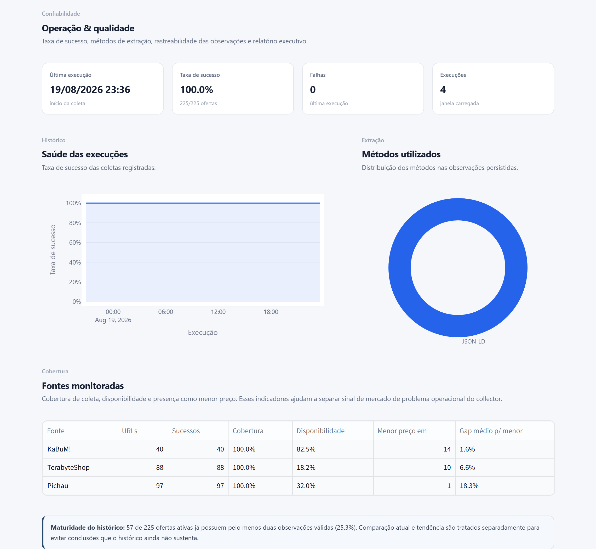

# Case Study — Competitive Intelligence Agent

## Contexto

Uma rotina simples de inteligência competitiva pode exigir que alguém abra repetidamente diversas páginas de concorrentes para registrar preço e disponibilidade.

Essa abordagem funciona em baixa escala, mas começa a falhar quando a quantidade de SKUs e fontes cresce:

- o trabalho é repetitivo;
- mudanças podem passar despercebidas;
- não existe histórico confiável;
- comparar títulos de produto manualmente é sujeito a erro;
- falhas de coleta podem ser confundidas com mudanças reais do mercado;
- cada relatório exige reconstruir a análise.

## Pergunta

> Como substituir o monitoramento manual de concorrentes por uma rotina contínua e rastreável que indique onde existe informação relevante para decisão?

## Critério de sucesso

O sistema deveria conseguir:

1. monitorar páginas públicas previamente selecionadas;
2. associar listings ao mesmo produto canônico;
3. registrar preço, disponibilidade, seller e horário;
4. manter histórico;
5. calcular sinais de forma determinística;
6. mostrar qualidade e falhas da própria coleta;
7. permitir investigação em linguagem natural sem entregar os cálculos ao LLM.

---

# Como a solução foi pensada

## Primeiro: definir o que era dado de mercado

Uma página publicada não significa automaticamente uma oferta comparável.

O sistema diferencia:

- preço extraído;
- disponibilidade;
- seller;
- canal;
- sucesso da coleta;
- método de extração.

Isso permite dizer não apenas “qual preço foi encontrado”, mas “qual o nível de confiança operacional nessa observação”.

## Segundo: tratar produto como entidade, não como texto

O mesmo SKU pode receber títulos diferentes em cada varejista.

A comparação parte de um produto canônico e prioriza MPN/SKU.

## Terceiro: separar coleta de análise

A coleta precisa ser confiável antes de qualquer conclusão.

Por isso o projeto separa:

```text
Collection Health
Market Analytics
AI Interpretation
```

## Quarto: usar IA somente onde existe incerteza interpretativa

Cálculos objetivos permanecem determinísticos.

O agente é utilizado para:

- decidir quais tools consultar;
- combinar diferentes evidências;
- explicar o que merece atenção;
- reconhecer quando o histórico é insuficiente.

---

# Desafios que apareceram de verdade

## `robots.txt` classificado incorretamente

Na primeira implementação, uma falha ao buscar o arquivo poderia ser interpretada como bloqueio total.

A correção separou erro de transporte de `Disallow` explícito e introduziu parsing com Protego.

## Sites com renderização diferente

Algumas fontes expõem JSON-LD diretamente; outras exigem navegador.

A solução tornou a coleta adaptativa:

```text
HTTP → retry/backoff → Playwright fallback
```

## Marketplace duplicando concorrente

Uma oferta publicada em marketplace pode ter como seller uma loja já monitorada diretamente.

A modelagem passou a distinguir `source` de `seller`.

## Histórico insuficiente

Um dashboard pode induzir conclusões erradas se tratar uma única coleta como tendência.

O projeto introduziu uma métrica de maturidade do histórico e comunica explicitamente quando os dados só permitem uma fotografia atual.

## PostgreSQL e SQLite não tipam booleano da mesma forma

O deploy público expôs um problema real que não aparecia em ambiente local com PostgreSQL: o snapshot SQLite entrega colunas booleanas ao Pandas como `int64` (0/1), não como `bool`. Um trecho do dashboard fazia `~obs["success"].fillna(False)` para isolar falhas — em `int64`, `~` é NOT bit a bit, não negação lógica (`~0` vira `-1`, `~1` vira `-2`), e `.loc[]` interpretava esses valores como rótulos de índice inexistentes, gerando `KeyError`. A correção converte explicitamente para `bool` antes de negar (`success.fillna(False).astype(bool)`), centralizada em `analytics.success_bool_mask()` e coberta por um teste que reproduz `success` como `int64` 0/1. A mesma lógica não foi aplicada a `available`, que é tri-state (`True` / `False` / desconhecido) e perderia informação se fosse forçado para booleano estrito.

## Disponibilidade não é ausência de dado

Uma decisão de modelagem que só ficou clara durante o desenvolvimento: `success=true` com `available=false` é um resultado válido — a página foi coletada e a oferta foi identificada como esgotada — não uma falha do pipeline. Essa distinção é o que permite ao analytics excluir corretamente ofertas indisponíveis do cálculo de menor/mediana/maior preço atual, sem descartar a observação do histórico, onde ela continua servindo como sinal competitivo (ex.: uma fonte que fica esgotada com frequência é, em si, informação de mercado). Sem separar `sem coleta`, `erro de coleta`, `produto sem estoque` e `oferta disponível` como quatro estados distintos, o dashboard teria misturado ruído operacional com sinal de mercado.

---

# Como apresentar este case em entrevista

Uma versão curta:

> “Eu parti de um problema de monitoramento competitivo manual. Modelei um catálogo de produtos canônicos, construí uma camada de coleta com HTTP, retry/backoff e fallback para Playwright, persisti histórico em PostgreSQL e separei indicadores determinísticos da interpretação por IA. Durante o desenvolvimento encontrei problemas reais com robots.txt, páginas dinâmicas e marketplaces, e ajustei a arquitetura para manter rastreabilidade. O agente acessa apenas tools MCP e não calcula preços ou indicadores por conta própria.”

## O que o case demonstra

- diagnóstico de problema;
- arquitetura antes da implementação;
- automação;
- web data collection;
- tratamento de erros;
- modelagem relacional;
- analytics;
- qualidade de dados;
- storytelling executivo;
- MCP;
- agentes de IA;
- Docker;
- testes;
- documentação.

---

# Screenshots do portfólio

Os três primeiros prints (README) formam uma narrativa única — problema/resposta → evidência → investigação — e por isso usam, quando possível, o mesmo produto real do snapshot atual.

## 1. Visão executiva — `docs/images/01-executive-overview.png`

Pergunta de negócio, maior dispersão do momento, liderança por preço e disponibilidade por fonte. Responde **o que o sistema descobriu**.

## 2. Mercado & preços — `docs/images/02-market-evidence.png`

Um SKU real com pelo menos duas ofertas disponíveis e dispersão visualmente clara: menor/mediana/maior preço, tabela por fonte, gráfico de preços. Mostra **a evidência**.

## 3. Analista de IA — `docs/images/03-ai-analyst.png`

Uma pergunta real que investiga o mesmo sinal mostrado nos dois prints anteriores, respondida com base nas tools MCP. Mostra **a investigação**.

## 4. Operação & qualidade



Taxa de sucesso, cobertura por fonte, métodos de coleta, maturidade do histórico, rastreabilidade. Fica apenas aqui (não no README) para manter o README enxuto. Mostra **que a análise não depende de dados tratados como caixa-preta**.

---

# O que evitar ao apresentar

Evitar descrever o projeto como:

> “scraper com IA”

ou:

> “dashboard usando Streamlit, MCP e Groq”

A tecnologia deve vir depois do problema.

A descrição preferida é:

> **Sistema automatizado de inteligência competitiva que coleta e historiza observações públicas de mercado, calcula sinais de preço e disponibilidade e disponibiliza evidências para análise executiva e investigação assistida por IA.**
